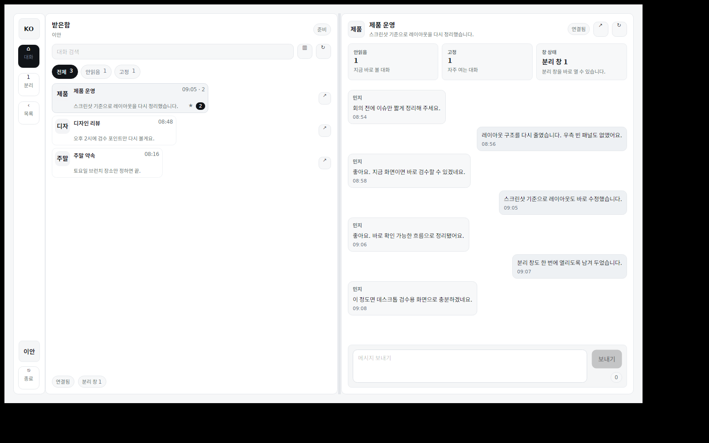

# KoTalk

  <strong>한국어 중심의 차분한 메시징 경험을 다시 설계하는 오픈소스 프로젝트.</strong>

  Windows 데스크톱을 중심에 두고, 모바일 웹과 Android를 병렬 확장하는 메신저 저장소입니다.

  짧은 답장, 빠른 복귀, 설명 가능한 제품 표면, 그리고 한국어 사용 습관에 맞는 조용한 UI를 핵심 기준으로 삼습니다.

  
  
  
  
  
  
  

  <a href="PROJECT_STATUS.md">Project Status</a> ·
  <a href="SHOWCASE.md">Showcase</a> ·
  <a href="BACKGROUND.md">Background</a> ·
  <a href="FAQ.md">FAQ</a> ·
  <a href="RELEASING.md">Releases</a> ·
  <a href="TRUST_CENTER.md">Trust Center</a> ·
  <a href="ARCHITECTURE.md">Architecture</a> ·
  <a href="문서/README.md">Master Plan</a> ·
  <a href="CONTRIBUTING.md">Contributing</a>

<table>
  <tr>
    <td align="center"><a href="https://vstalk.phy.kr"><strong>Try Web</strong></a> 모바일 웹 진입점</td>
    <td align="center"><a href="SHOWCASE.md"><strong>See Screens</strong></a> 최신 화면 묶음</td>
    <td align="center"><a href="PROJECT_STATUS.md"><strong>Read Status</strong></a> 현재 동작 범위</td>
    <td align="center"><a href="RELEASING.md"><strong>Get Builds</strong></a> 미러와 릴리즈 경로</td>
  </tr>
</table>

  

  <em>플랫한 화이트 톤과 컴팩트한 창 밀도를 기준으로 정리한 현재 데스크톱 셸</em>

## Snapshot

| Layer | Current read |
|---|---|
| What this is | 한국어 UI, 낮은 피로도, 업무형 메시징 복귀 흐름을 중심에 둔 Windows-first 오픈소스 메신저 |
| What works now | Windows 빌드, 모바일 웹 라이브, 기본 인증/대화/세션 루프 |
| What is still moving | Android 첫 실빌드, 파일 전송, 검색 확장, 공개 다운로드 미러 정합성 |
| What this repo tries to show | 화면, 빌드 산출물, 릴리즈 경로, 상태 문서, 배경 문서를 한 눈에 읽히게 정리한 제품형 저장소 |

## Why Now

KoTalk는 단순히 새로운 메신저를 하나 더 만드는 시도가 아닙니다. 최근 몇 년간 국내 메신저 여론에서 반복적으로 드러난 피로는 대체로 비슷했습니다. 대화보다 콘텐츠가 먼저 보이는 구조, 설명이 늦는 운영정책, 신뢰를 깎는 개인정보 이슈, 반복 장애에 대한 피로감이 그것입니다.

이 저장소는 그 불만을 과격하게 소비하려는 프로젝트가 아니라, 더 조용하고 더 짧고 더 예측 가능한 한국어 메시징 경험을 다시 설계해 보려는 제안입니다. 익숙한 메신저 문법은 존중하되, 반복해서 확인하는 목록, 답장을 미루지 않게 돕는 흐름, 업무적 대화와 사적 대화가 서로 피로를 만들지 않는 구조를 우선합니다.

특히 최근 공개 기사와 여론에서 반복적으로 읽히는 네 가지 신호를 중요한 배경으로 봅니다.

- 친구 탭 피드화, 숏폼, 광고 노출 확대에 대한 강한 UI 피로
- 개인정보와 프라이버시 이슈 이후 높아진 기본 보안 기대
- 운영정책 강화가 있을 때 더 크게 요구되는 설명 책임
- PC 로그인과 메시지 전송 장애가 반복될 때 누적되는 불신

KoTalk는 이 배경을 리스크 문구로 숨기지 않고, 왜 이 프로젝트가 필요한지 설명하는 핵심 맥락으로 다룹니다. 배경 요약은 [BACKGROUND.md](BACKGROUND.md), 더 긴 맥락은 [문서/14-project-background-and-market-context.md](문서/14-project-background-and-market-context.md)에 정리돼 있습니다.

## What Makes KoTalk Different

| Focus | KoTalk approach |
|---|---|
| Desktop priority | Windows를 중심축으로 두고, 넓은 화면에서 짧은 클릭 수와 멀티 윈도우 흐름을 우선합니다. |
| UI mood | 각진 패널, 얇은 보더, 플랫한 화이트 톤, 설명보다 구조가 먼저 보이는 화면을 지향합니다. |
| Work communication | 검색, 보관, 후속조치, 복귀 시간을 줄이는 흐름을 제품 핵심으로 둡니다. |
| Transparency | 상태 문서, 릴리즈 경로, 스크린샷, 현재 한계를 함께 적습니다. |
| Deployment choice | 공개 서비스와 자체 호스팅 가능한 오픈소스 코어를 구분해 설명합니다. |

## Current Experience Shelf

현재 저장소에서 바로 볼 수 있는 화면과 산출물은 아래와 같습니다.

| Surface | What to look at | Visual |
|---|---|---|
| Desktop shell | 레일 + 목록 + 대화 중심의 3단 구조, 플랫한 보더, 멀티 윈도우 전제 | [hero-shell.png](docs/assets/latest/hero-shell.png) |
| Desktop onboarding | 첫 실행 시 서버 주소보다 사용자 흐름을 먼저 보여주는 가벼운 진입 | [onboarding.png](docs/assets/latest/onboarding.png) |
| Desktop conversation | 메시지 흐름, 읽기 상태, 입력 패널의 조밀한 배치 | [conversation.png](docs/assets/latest/conversation.png) |
| Mobile web onboarding | 빠른 진입과 한국어 중심의 간결한 가입 흐름 | [vstalk-web-onboarding.png](docs/assets/latest/vstalk-web-onboarding.png) |
| Mobile web inbox | 최근 대화, 필터, 검색 진입의 기본 구조 | [vstalk-web-list.png](docs/assets/latest/vstalk-web-list.png) |
| Mobile web search | 대화 재발견과 보관 흐름의 1차 구현 | [vstalk-web-search.png](docs/assets/latest/vstalk-web-search.png) |
| Mobile web saved | 나중에 답장, 중요 대화, 다시 열기 허브 | [vstalk-web-saved.png](docs/assets/latest/vstalk-web-saved.png) |
| Mobile web chat | 모바일 입력창, 상단 정보 밀도, 복귀 동선 | [vstalk-web-chat.png](docs/assets/latest/vstalk-web-chat.png) |

전체 화면 묶음은 [SHOWCASE.md](SHOWCASE.md)에서 더 자세히 볼 수 있습니다.

## Channels

| Channel | Surface | Status | Notes |
|---|---|---|---|
| Windows desktop | 저장소 빌드와 버전별 산출물 | Buildable | 핵심 메시징 루프와 데스크톱 레이아웃 실험 진행 중 |
| Mobile web | [vstalk.phy.kr](https://vstalk.phy.kr) | Live | 가입, 대화, 검색, 보관 1차 흐름 검증 |
| Android | 저장소 릴리즈 예정 | In progress | 문서와 배포 구조 우선 정리 중 |
| Official download mirror | [download-vstalk.phy.kr](https://download-vstalk.phy.kr) | Normalizing | 2026-04-16 기준 DNS/HTTPS 정합성 점검 진행 중 |

## Architecture Snapshot

KoTalk의 현재 구조는 지나치게 복잡한 플랫폼보다, 작은 조각을 조합해 실서비스와 로컬 빌드를 함께 검증하는 쪽에 가깝습니다.

- 클라이언트: Windows 데스크톱 + 모바일 웹 + Android 예정
- API: 인증, 최근 대화, 메시지 전송, 읽기 커서, 세션 루프
- 배포: VPS 기반 same-origin 웹앱과 API 운영
- 공개 증거: 저장소 스크린샷, 빌드 산출물, 상태 문서, 릴리즈 경로

자세한 구성은 [ARCHITECTURE.md](ARCHITECTURE.md), 배포 모드는 [DEPLOYMENT_MODES.md](DEPLOYMENT_MODES.md), 로드맵은 [ROADMAP.md](ROADMAP.md)에서 확인할 수 있습니다.

## Download Paths

공식 링크 하나에만 의존하지 않고, 저장소 릴리즈 경로를 함께 제공합니다.

| Path | Link |
|---|---|
| Official mirror | [download-vstalk.phy.kr](https://download-vstalk.phy.kr) |
| Windows latest | [download-vstalk.phy.kr/windows/latest](https://download-vstalk.phy.kr/windows/latest) |
| Android latest | [download-vstalk.phy.kr/android/latest](https://download-vstalk.phy.kr/android/latest) |
| Version manifest | [download-vstalk.phy.kr/latest/version.json](https://download-vstalk.phy.kr/latest/version.json) |
| Public stage repo | [physia.kr/open-source/projects/public/kotalk](https://physia.kr/open-source/projects/public/kotalk) |
| Forge releases | [git.physia.kr/ian/vs-messanger/releases](https://git.physia.kr/ian/vs-messanger/releases) |
| GitHub releases | [github.com/werther24601/kotalk/releases](https://github.com/werther24601/kotalk/releases) |

릴리즈 정책과 현재 미러 상태는 [RELEASING.md](RELEASING.md), [PROJECT_STATUS.md](PROJECT_STATUS.md)에 함께 기록합니다.

## Principles

- 한국어 UI는 번역체보다 실제 사용 흐름을 우선합니다.
- 둥글고 장식적인 UI보다 각진 구조, 플랫한 깊이, 짧은 텍스트, 높은 밀도를 택합니다.
- 개인 대화와 업무형 소통 모두에서 검색, 복귀, 정리, 후속조치가 더 짧아져야 합니다.
- 공식 서비스와 오픈소스 코어, 저장소 공개 표면은 같은 문장으로 뭉개지지 않게 설명합니다.
- 보안은 과장된 문구보다 현재 적용 범위와 남은 과제를 함께 적는 방식으로 다룹니다.

## Reading Paths

처음 보는 독자라면 아래 순서가 가장 빠릅니다.

1. [PROJECT_STATUS.md](PROJECT_STATUS.md)
2. [SHOWCASE.md](SHOWCASE.md)
3. [BACKGROUND.md](BACKGROUND.md)
4. [FAQ.md](FAQ.md)
5. [문서/README.md](문서/README.md)

기여 관점이라면 [CONTRIBUTING.md](CONTRIBUTING.md), [COMMUNITY.md](COMMUNITY.md), [DEVELOPMENT.md](DEVELOPMENT.md)를 먼저 보면 됩니다.

제품 방향을 더 길게 읽고 싶다면 아래 문서를 권합니다.

- [ROADMAP.md](ROADMAP.md)
- [BUSINESS_MODEL.md](BUSINESS_MODEL.md)
- [문서/01-product-strategy-and-mvp.md](문서/01-product-strategy-and-mvp.md)
- [문서/18-white-material-compact-ui-system.md](문서/18-white-material-compact-ui-system.md)
- [문서/22-work-communication-ux-playbook.md](문서/22-work-communication-ux-playbook.md)

## Security And Trust

공개 저장소에서 약속하는 범위는 아래 문서에 나눠 적습니다.

- [TRUST_CENTER.md](TRUST_CENTER.md): 현재 통제, 남은 갭, 표현 원칙
- [SECURITY.md](SECURITY.md): 제보 경로와 기본 보안 정책
- [SECURITY_RESPONSE.md](SECURITY_RESPONSE.md): 접수와 공개 절차
- [PRIVACY_AND_DATA_HANDLING.md](PRIVACY_AND_DATA_HANDLING.md): 현재 데이터 경계
- [DEPLOYMENT_MODES.md](DEPLOYMENT_MODES.md): 공식 서비스, 셀프호스팅, 규제 환경 배포 구분

## Open-Source And Service Boundary

KoTalk는 저장소 공개 코드와 운영 서비스의 경계를 분명히 둡니다.

- 이 저장소는 Apache-2.0 기반의 오픈소스 코어와 공개 문서를 다룹니다.
- 운영 서비스와 배포 지원은 별도 표면으로 설명합니다.
- 자체 호스팅과 향후 사설망/폐쇄망 배포 가능성은 중요한 방향이지만, 검증 전 항목은 검증 완료처럼 쓰지 않습니다.

자세한 구조는 [BUSINESS_MODEL.md](BUSINESS_MODEL.md), [DEPLOYMENT_MODES.md](DEPLOYMENT_MODES.md), [PROCUREMENT_READINESS.md](PROCUREMENT_READINESS.md)에 정리해 두었습니다.

## Maintained By

KoTalk는 현재 PHYSIA가 유지하고 있습니다. 실무 연락은 [SUPPORT.md](SUPPORT.md), 운영 모델은 [GOVERNANCE.md](GOVERNANCE.md), 메인테이너 정보는 [MAINTAINERS.md](MAINTAINERS.md)를 참고하세요.
