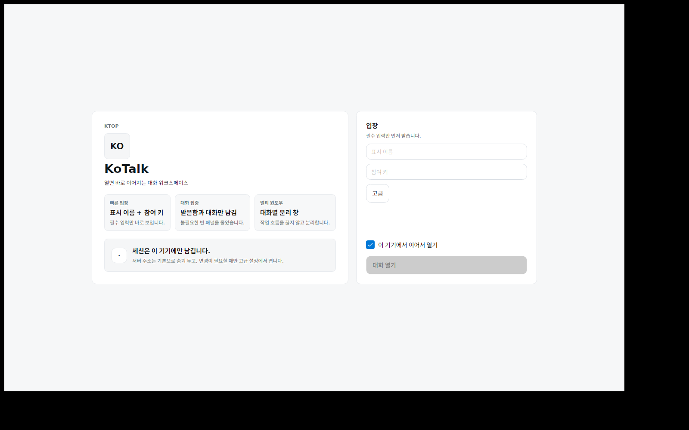
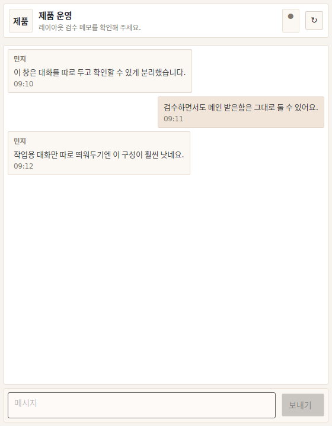
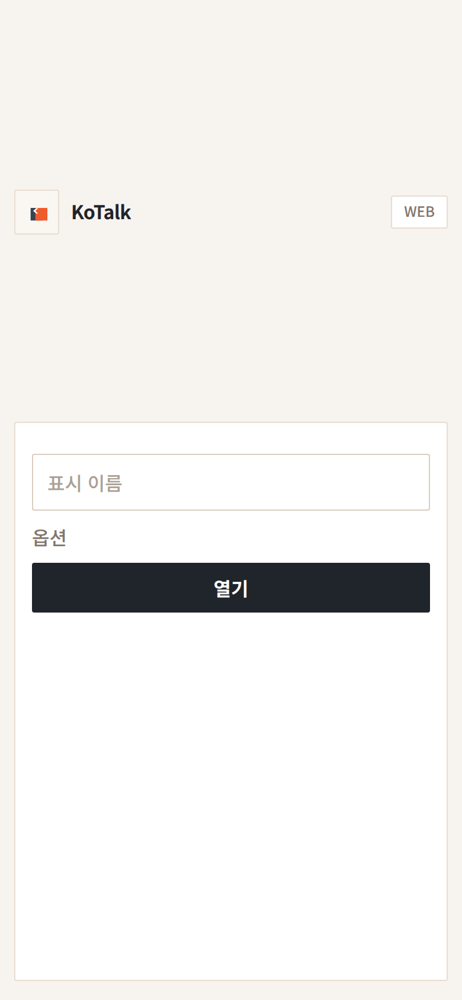
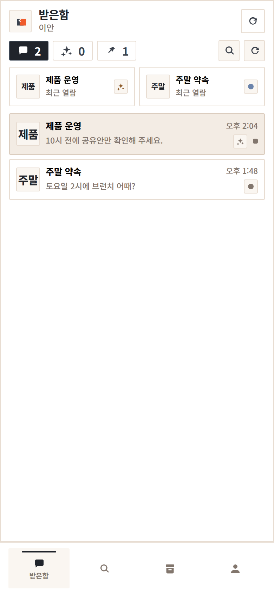
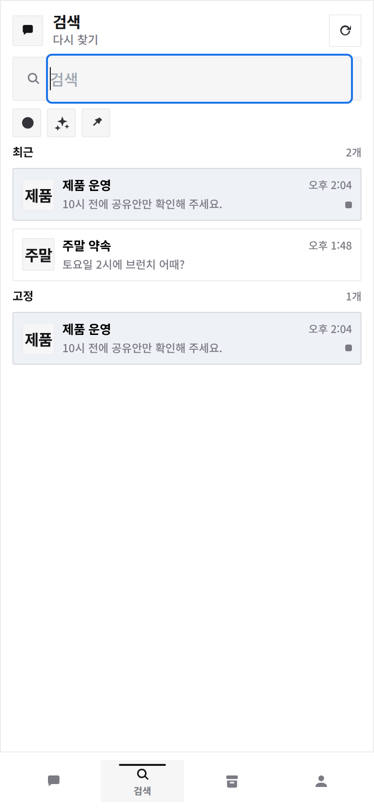
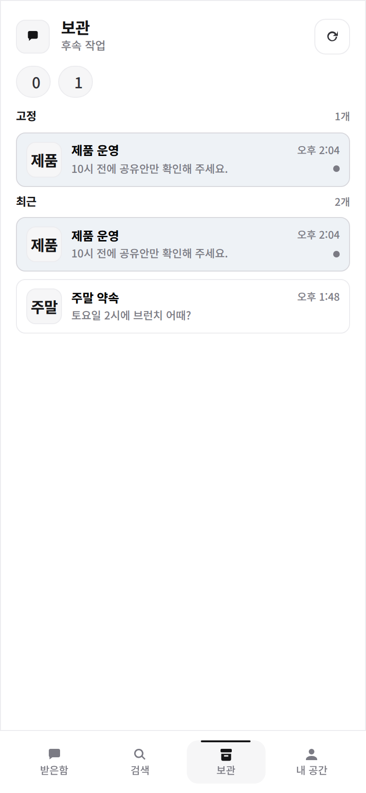
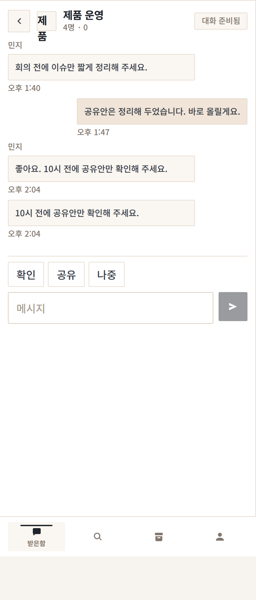

# Showcase

KoTalk의 현재 공개 표면을 짧게 훑어보는 문서가 아니라, 지금 저장소에서 실제로 확인할 수 있는 화면과 동작 범위를 빠르게 따라가는 문서입니다.

## Live Surfaces

| Surface | Link | What it shows |
|---|---|---|
| Mobile web | [vstalk.phy.kr](https://vstalk.phy.kr) | 실제 공개 중인 모바일 웹 흐름 |
| Official download mirror | [download-vstalk.phy.kr](https://download-vstalk.phy.kr) | 공식 다운로드 미러 경로 |
| Public stage repo | [physia.kr/open-source/projects/public/kotalk](https://physia.kr/open-source/projects/public/kotalk) | 제2 공개 레포 |
| Forge releases | [git.physia.kr/ian/vs-messanger/releases](https://git.physia.kr/ian/vs-messanger/releases) | 내부 기준 릴리즈 채널 |
| GitHub releases | [github.com/werther24601/kotalk/releases](https://github.com/werther24601/kotalk/releases) | 공개 릴리즈 채널 |

## Desktop Walkthrough

데스크톱은 화려한 장식보다 `레일 + 목록 + 대화`에 집중합니다. 넓은 화면을 “정보를 더 많이 보여 주는 곳”이 아니라 “답장과 전환을 덜 피곤하게 만드는 곳”으로 해석하는 쪽에 가깝습니다.

### What To Notice

- 좌측 레일은 목적지 전환을 맡고, 설명 텍스트는 최소화합니다.
- 가운데 목록은 최근성, 읽지 않음, 고정 흐름을 조밀하게 처리합니다.
- 오른쪽 대화 패널은 입력과 복귀 흐름이 끊기지 않게 밀도를 높입니다.
- 멀티 윈도우 전제 설계라서 대화를 분리해 보는 흐름을 계속 강화하고 있습니다.

### Desktop Screens

<table>
  <tr>
    <td align="center">
       
      <strong>Desktop shell</strong> 
      현재 데스크톱 전체 셸의 구조와 밀도
    </td>
    <td align="center">
       
      <strong>Desktop onboarding</strong> 
      첫 진입에서 먼저 보이는 정보
    </td>
  </tr>
</table>

   
  <strong>Desktop conversation</strong> 
  실제 대화 화면의 읽기 흐름과 입력 밀도

## Mobile Web Walkthrough

모바일 웹은 빠른 진입과 짧은 복귀가 핵심입니다. 설명을 길게 읽게 하기보다, 대화 목록과 검색, 보관, 다시 열기 흐름을 짧은 탭 구조로 분리합니다.

### What To Notice

- 온보딩은 길고 복잡한 가입보다 빠른 진입을 우선합니다.
- 목록은 최근 대화와 필터, 검색 진입을 한 화면에서 해결합니다.
- 검색은 단순 텍스트 필터가 아니라 다시 찾아야 하는 대화를 더 빨리 여는 방향으로 확장 중입니다.
- 보관 화면은 “나중에 다시 답장해야 할 것”을 모아 보는 허브 역할을 맡습니다.

### Mobile Web Screens

<table>
  <tr>
    <td align="center">
       
      <strong>Onboarding</strong> 
      초기 진입과 가입 흐름
    </td>
    <td align="center">
       
      <strong>Inbox</strong> 
      현재 받은함 구조
    </td>
    <td align="center">
       
      <strong>Search</strong> 
      검색과 재발견 흐름
    </td>
  </tr>
  <tr>
    <td align="center">
       
      <strong>Saved</strong> 
      보관과 후속조치 허브
    </td>
    <td align="center">
       
      <strong>Chat</strong> 
      모바일 대화 화면의 현재 밀도
    </td>
    <td></td>
  </tr>
</table>

## Build And Artifact Shelf

저장소 안에는 화면만 있는 것이 아니라, 현재 기준의 빌드 산출물과 최신 스크린샷도 함께 남깁니다.

- 릴리즈 정책: [RELEASING.md](RELEASING.md)
- 현재 상태 요약: [PROJECT_STATUS.md](PROJECT_STATUS.md)
- 최신 화면 자산: [docs/assets/latest/README.md](docs/assets/latest/README.md)
- 제품 방향 전체: [문서/README.md](문서/README.md)

## What This Showcase Is Trying To Prove

이 문서는 “멋있어 보이는 이미지 모음”보다 아래 세 가지를 보여주려 합니다.

- KoTalk가 단순한 기획 문서 저장소가 아니라 실제 화면과 빌드 결과를 가진 프로젝트라는 점
- 한국어 데스크톱 메시징 경험을 다시 다듬는다는 방향이 UI와 정보 구조에 실제 반영되고 있다는 점
- 현재 부족한 부분도 숨기지 않고, 상태 문서와 다음 작업 우선순위가 함께 공개돼 있다는 점

## Read Next

- 현재 상태: [PROJECT_STATUS.md](PROJECT_STATUS.md)
- 배경과 문제의식: [BACKGROUND.md](BACKGROUND.md)
- 공개 규칙: [RELEASING.md](RELEASING.md)
- 제품 기획: [문서/README.md](문서/README.md)
